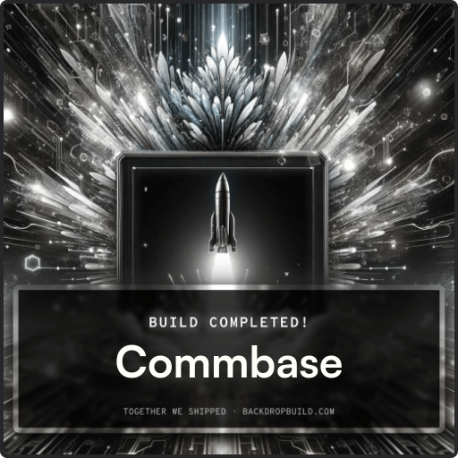

<div align="center">

[](https://github.com/mydroidandi/commbase/actions/workflows/python-package-conda.yml)
[](https://img.shields.io/badge/python-3.10%20%7C%203.11%20%7C%203.12-blue)
[](https://github.com/mydroidandi/commbase/actions/workflows/python-flake8-lint.yml)
[](https://github.com/mydroidandi/commbase/actions/workflows/jq-json-lint.yml)
[](https://github.com/mydroidandi/commbase/actions/workflows/shell-lint.yml)

</div>

<div align="center">

# Commbase 

</div>

<div align="center">


</div>

<div align="center">

[Watch the video](https://youtu.be/YMljUy37aSc?si=TiScnkugTpUjtXMn)

</div>

<br />

<div align="center">

🤖✨ Dialog-first platform for developing interactive AI-Powered assistant-like applications on Linux

</div>

## Introduction

**Commbase**, short for Communicative Commands Base, is a comprehensive platform designed to empower computers and computer-based devices with cutting-edge conversational AI capabilities. While it includes a flexible and extensible ✨ development framework ✨ at its core, Commbase goes beyond mere development tools. It serves as both a module and library bundler, incorporating third-party Language Models (LLMs, etc.) to enable advanced features such as "distributed AIs" or "multi-agent systems" (MAS). Commbase adapts across a diverse range of devices, from computers to smart appliances, robots, vehicles, Iron Man-like suits, starships, and beyond, ensuring universal accessibility and functionality. Operating effortlessly on either a single machine or a pair of machines in a client-server architecture, Commbase offers unparalleled adaptability and scalability.

## Links and Resources
- GitHub Repository: https://github.com/mydroidandi/commbase
- Documentation: https://github.com/estebanways/commbase/tree/main/assets/docs
- Website: https://commbase-website.vercel.app/

## Features

### Feature Insights

| Topic                   | Features                                                                                                                                                          |
|-------------------------|----------------------------------------------------------------------------------------------------------------------------------------------------------------------|
| ⚙️ Control & Accessibility | Offers multiple methods to start and stop Commbase, including init systems, cron jobs, terminal commands, or voice commands. Provides a terminal-based interface and option for custom UIs.      |
| 🖥️ Multi-pane Support      | Facilitates multitasking and organization within Commbase by providing a versatile workspace with options for navigating between different functionalities.                  |
| 📝 Logging & Recording     | Enables transparent monitoring of system activity, troubleshooting, and security maintenance through the recording of terminal and voice commands, along with secure access control.   |
| 🔧 Configuration           | Simplifies customization of Commbase to meet specific user needs and preferences by offering easy-to-adjust centralized configuration files for built-in options.               |
| 🤖 Advanced Capabilities   | Demonstrates sophistication and cutting-edge AI functionalities by integrating Language Models and advanced assistant capabilities such as language understanding and vision. |

### Detailed Feature Overview

| Topic                   | Features                                                                                                                                                                        |
|-------------------------|---------------------------------------------------------------------------------------------------------------------------------------------------------------------------------|
| 🛠️ Installation & Setup    | * Detailed installation steps, structure, and contribution guidelines are available on the GitHub repository, ensuring secure and transparent setup processes.                    |
| 💻 Commands & Interfaces   | * Help option to see available built-in commands for terminal use or development. <br> * Built-in commands support both voice and terminal command calls.                        |
| ⚙️ Control & Accessibility | * Easy to start and stop using init systems, cron jobs, terminal commands, or voice commands. <br> * Terminal-based interface, with the option to create custom UIs.            |
| 🔀 Navigation              | * Seamlessly switch among windows using keybindings to access dashboards, server connections, etc.                                                                            |
| 🖥️ Multi-pane Support      | * Multiple panes are provided, covering functionalities like the chat room, STT engine (Speech-to-Text), server pane, client pane, and additional options. |
| 📂 Custom Applications     | * Load custom terminal applications and seamlessly switch back to the chat room in the same pane.                                                                             |
| 🎨 Personalization         | * Customizable application, user, and assistant names.                                                                                                                                       |
| 📝 Logging & Recording     | * Terminal and voice command recorder-transmitter area easy to install even in other hosts for remote control through networks, with enabled secure access control and logging.  |
| 🔧 Configuration           | * Effortlessly adjust and customize your settings with our platform's centralized configuration files. No code is required to configure built-in options.                        |
| 🗣️ STT & TTS Engines       | * The STT Engine operates in Whisper reactive mode by default, with the ability to switch to Whisper proactive mode at any time. <br> * TTS Engines are dedicated for text-to-speech functionalities, so projects can effectively speak in various languages, enhancing accessibility and global reach.      |
| 🌍 Internationalization    | * Support to global audiences with seamless internationalization. <br> * Tailor your user experience by modifying i18n files to customize voice commands.                        |
| 📜 Custom Scripting        | * Effortlessly create custom server-side command scripts with a single file catalog database (scalable to any RDBMS), our up-to-date well-documented API, and JSON simplicity. <br> * Write command scripts in any programming language.             |
| ♻️ Reusable Functions      | * Access to a comprehensive library of reusable functions to enhance custom command scripts with streamlined efficiency and tailored functionalities.                           |
| 🤖 Advanced Capabilities   | * LLMs (Large Language Models), SLMs (Small Language Models), and other Language Models integration. <br> * Enhanced assistant capabilities with advanced language understanding, including additional features like vision.               |
| 📊 Activity Management     | * Efficiently manage your system's activity and user interactions by seamlessly integrating Commbase logs with custom app logs.  <br> * Logs include customizable backups of past assistant-user conversations.                                              |
| 🛡️ Platform Stability      | * The use of Linux enhances the stability, reliability, and security of our software, ensuring robust and flexible performance in various environments.                        |

## Bundles

Bundles in Commbase refer to packaged collections of software components, applications, dependencies, or data that are bundled together for ease of distribution, installation, or deployment in various computing environments.

In the context of Commbase, users are allowed to modify existing bundles or create custom ones. This flexibility allows users to tailor the functionality and features to their specific needs, whether by adjusting configurations, integrating custom plugins or extensions, or creating entirely new functionalities within the software framework.

<a href="./bundles/commbase-data-exchange/">
    
</a>

**commbase-data-exchange**

An application for exchanging JSON data over HTTP and WebSocket connections, allowing clients to save and retrieve JSON data in real-time. [More Info](/bundles/commbase-data-exchange/)

<a href="./bundles/commbase-genai-llm-google-gemini-p/">
    
</a>

**commbase-genai-llm-google-gemini-p**

This app allows you to chat with Gemini, a powerful large language model. Ask questions, get creative writing inspiration, or receive help with tasks. [More Info](/bundles/commbase-genai-llm-google-gemini-p/)

<a href="./bundles/commbase-genai-llm-meta-llama-p/">
    
</a>

**commbase-genai-llm-meta-llama-p**

This app allows you to interact with Llama, a large language model known for its factual language understanding and reasoning abilities. Ask questions, get help with research, or gain insights from complex information. [More Info](/bundles/commbase-genai-llm-meta-llama-p/)

<a href="./bundles/commbase-genai-llm-openai-gpt-p/">
    
</a>

**commbase-genai-llm-openai-gpt-p**

An app designed to facilitate seamless interaction with the powerful OpenAI's GPT language model. This app empowers users to engage in natural language conversations with the model. [More Info](/bundles/commbase-genai-llm-openai-gpt-p/)

<a href="./bundles/commbase-genai-slm-ollama-phi3-mini-memory/">
    
</a>

**commbase-genai-slm-ollama-phi3-mini-memory**

Interacts with the Commbase platform by generating AI-driven responses using the Ollama API with the Phi3 mini model from Microsoft. This is a midweight implementation with session or short-term memory for language generation. [More Info](/bundles/commbase-genai-slm-ollama-phi3-mini-memory/)

<a href="./bundles/commbase-genai-slm-ollama-phi3-mini-memory-remote-rag-picone/">
    
</a>

**commbase-genai-slm-ollama-phi3-mini-memory-remote-rag-picone**

Interacts with the Commbase platform by generating AI-driven responses using the Ollama API with the Phi3 mini model from Microsoft. This is a heavyweight implementation with memory for language generation, featuring remote RAG and Picone for persistent memory. [More Info](/bundles/commbase-genai-slm-ollama-phi3-mini-memory-remote-rag-picone/)

<a href="./bundles/commbase-genai-slm-ollama-phi3-mini-nomemory/">
    
</a>

**commbase-genai-slm-ollama-phi3-mini-nomemory**

Interacts with the Commbase platform by generating AI-driven responses using the Ollama API with the Phi3 mini model from Microsoft. This is a lightweight implementation without memory for language generation. [More Info](/bundles/commbase-genai-slm-ollama-phi3-mini-nomemory/)

<a href="./bundles/commbase-recorder-transmitter-b/">
    
</a>

**commbase-recorder-transmitter-b**

commbase-recorder-transmitter-b is a voice recorder and recording transmitter for Commbase. It also supports sending the recorded audio file to a remote host using scp when the recording is stopped with another key press. [More Info](/bundles/commbase-recorder-transmitter-b/)

<a href="./bundles/commbase-recorder-transmitter-s/">
    
</a>

**commbase-recorder-transmitter-s**

commbase-recorder-transmitter-s is a voice recorder and recording transmitter for Commbase. It also supports sending the recorded audio file to a remote host using scp when the recording is stopped with another key press. [More Info](/bundles/commbase-recorder-transmitter-s/)

<a href="./bundles/commbase-stt-whisper-proactive-p/">
    
</a>

**commbase-stt-whisper-proactive-p**

This is an OpenAI's Whisper-based proactive ASR (Automatic Speech Recognition) engine designed to convert spoken language into written text without requiring an internet connection, making it a reliable and secure solution for any application that needs speech-to-text functionality. [More Info](/bundles/commbase-stt-whisper-proactive-p/)

<a href="./bundles/commbase-stt-whisper-reactive-p/">
    
</a>

**commbase-stt-whisper-reactive-p**

This is an OpenAI's Whisper-based reactive ASR (Automatic Speech Recognition) engine designed to convert spoken language into written text without requiring an internet connection, making it a reliable and secure solution for any application that needs speech-to-text functionality. [More Info](/bundles/commbase-stt-whisper-reactive-p/)

<a href="./bundles/commbase-tts-gTTS/">
    
</a>

**commbase-tts-gTTS**

A Commbase-ready TTS executable using gTTS (Google Text-to-Speech), a Python library and CLI tool to interface with Google Translate text-to-speech API. [More Info](/bundles/commbase-tts-gTTS/)

<a href="./bundles/commbase-tts-pyttsx3/">
    
</a>

**commbase-tts-pyttsx3**

commbase-tts-pyttsx3 is a Python application that utilizes text-to-speech capabilities to read out the content of a file or any input text provided. It uses the pyttsx3 library for text-to-speech functionality. This application supports multiple languages, allowing you to generate speech in various languages. [More Info](/bundles/commbase-tts-pyttsx3/)

<a href="./bundles/libcommbase">
    
</a>

**libcommbase**

libcommbase is a core collection of libraries that provides foundational functionalities to Commbase and offers functionalities to Commbase-based applications. It centralizes common functions that can be shared across multiple conversational AI-powered assistant projects. [More Info](/bundles/libcommbase/)

## Usage

<div align="center">


</div>

<br/>

[**INSTALL**](./INSTALL) Commbase and then run the next command in a terminal to start the program:

`commbase start`

Commbase will be ready to receive Commbase voice commands and Commbase terminal commands to assist you.

For more terminal options, run:

`commbase -h`

Check out the User's Guide for a complete list of options.

## Installation

For information on how to install Commbase, follow the steps in the file [**INSTALL**](./INSTALL).

## User's Guide

For information on how to set up, use, and program Commbase read the User's Guide.

* [docs](/assets/docs)

## Structure

This project is coded and organized like this:

```sh
/path/to/my/commbase/app
├── assets  # Stores different types of assets, such as images, fonts, and ASCII art
│   ├── ascii
│   ├── docs  # Stores the Commbase User's Guide
│   │   └── images
│   ├── fonts
│   ├── icons
│   └── images
├── bundles  # External software bundle and external asset bundle
│   ├── commbase-data-exchange
│   │   ├── client
│   │   │   └── templates
│   │   ├── examples
│   │   └── server
│   │       ├── client_data
│   │       └── templates
│   ├── commbase-genai-llm-google-gemini-p
│   │   └── examples
│   ├── commbase-genai-llm-meta-llama-p
│   │   └── examples
│   ├── commbase-genai-llm-openai-gpt-p
│   │   └── examples
│   ├── commbase-genai-slm-ollama-phi3-mini-memory
│   │   └── examples
│   ├── commbase-genai-slm-ollama-phi3-mini-memory-remote-rag-picone
│   │   ├── examples
│   │   └── resources
│   │       └── src
│   ├── commbase-genai-slm-ollama-phi3-mini-nomemory
│   │   └── examples
│   ├── commbase-recorder-transmitter-b
│   │   └── examples
│   ├── commbase-recorder-transmitter-s
│   │   └── examples
│   ├── commbase-stt-whisper-proactive-p
│   │   └── examples
│   ├── commbase-stt-whisper-reactive-p
│   │   ├── client_data
│   │   └── examples
│   ├── commbase-tts-gTTS
│   │   └── examples
│   ├── commbase-tts-pyttsx3
│   └── libcommbase
│       ├── examples
│       ├── libcommbase
│       │   ├── interactive
│       │   └── routines
│       └── resources
│           ├── bundles
│           │   └── sounds
│           └── i18n
│               ├── control_patterns
│               │   └── openai_whisper_models
│               │       ├── base
│               │       └── ...
│               ├── discourses
│               ├── log_messages
│               └── skill_patterns
│                   └── openai_whisper_models
│                       ├── base
│                       └── ...
├── certificates  # Stores the security certificates
├── config  # Stores the configuration file
├── data  # Stores the voice recognition model results and other data files
├── env  # Stores the environment file
├── history  # Stores the Commbase commands history
├── i18n  # Stores resources related to localization and internationalization
│   ├── discourses
│   └── log_messages
├── log  # Stores the log messages
├── screenshots  # Stores the image commbase.png
├── scripts  # Stores the scripts for deploying and configuring Commbase, and a few utils
│   ├── configuration
│   │   ├── install_commbase_executable
│   │   └── reset_commbase.conf
│   ├── deployment
│   └── utilities
│       ├── back-up
│       └── bundles
│           └── vu-meter
├── src  # This directory contains user/dev-generated source code
│   ├── client
│   │   ├── assets  # Stores different types of assets, such as images, fonts, and ASCII art
│   │   │   ├── ascii
│   │   │   └── docs  # Stores your app User's Guide
│   │   ├── bundles
│   │   │   ├── audiobooks
│   │   │   │   └── Robinson_Crusoe
│   │   │   ├── terminal-chat-gpt
│   │   │   └── ...
│   │   ├── config
│   │   ├── i18n
│   │   │   ├── discourses
│   │   │   ├── log_messages
│   │   │   └── skill_patterns
│   │   │       └── openai_whisper_models
│   │   │           ├── base
│   │   │           └── ...
│   │   ├── log
│   │   └── serial_communication
│   │       ├── arduino
│   │       │   ├── arduino_0
│   │       │   │   ├── commbase_hardware_notifications
│   │       │   │   │   ├── sentiment_component
│   │       │   │   │   ├── speech_to_text_engine_component
│   │       │   │   │   └── ...
│   │       │   │   └── ...
│   │       │   └── ...
│   │       └── ...
│   ├── server
│   │   └── skills_db
│   │       ├── arduino
│   │       ├── bash
│   │       │   ├── f
│   │       │   │   ├── firefox
│   │       │   │   └── ...
│   │       │   └── o
│   │       │       ├── openai
│   │       │       └── ...
│   │       ├── c++
│   │       ├── java
│   │       ├── multi-lang
│   │       ├── nodejs
│   │       ├── python
│   │       ├── rust
│   │       └── ...
│   └── tests
├── tests  # Stores the Commbase tests
└── user  # Stores chat conversations, assistant's memories, and other user workspace files
    ├── analysis_zone
    ├── conversation_logs
    ├── knowledge_base
    ├── memory_store
    │   ├── commbase-genai-slm-ollama-phi3-mini-memory-remote-rag-picone
    │   │   ├── build
    │   │   └── src
    │   └── ...
    └── ...
```

## Tech Stack

Core technologies directly involved in the application's functionality.

### Required in The Default Installation

[OpenAI Whisper](https://openai.com/research/whisper) | [Ollama](https://ollama.com) | [Microsoft Phi3](https://huggingface.co/microsoft/Phi-3-mini-4k-instruct) | [Picone](https://www.pinecone.io/) | [PyAudio](https://people.csail.mit.edu/hubert/pyaudio/) |  [Awk](https://www.gnu.org/software/gawk/) | [Git](https://git-scm.com) | [Jq](https://stedolan.github.io/jq/) | [SSH](https://www.openssh.com) | [Flask](https://flask.palletsprojects.com)| [NumPy](https://numpy.org) | [Pandas](https://pandas.pydata.org) | [Pyttsx3](https://pypi.org/project/pyttsx3/) | [FFmpeg](https://ffmpeg.org) | [GNU/Linux](https://www.gnu.org/gnu/linux-and-gnu.html) | [Systemd](https://systemd.io/) | [Bash](https://www.gnu.org/software/bash/) | [Bc](https://www.gnu.org/software/bc/) | [Python](https://python.org) | [Oh My Tmux](https://github.com/gpakosz/.tmux) | [Tmux](https://github.com/tmux/tmux)

### Optional

[Anaconda](https://anaconda.com) | [Google Gemini](https://deepmind.google/technologies/gemini/) | [Meta Llama](https://llama.meta.com/) | [OpenAI GPT](https://openai.com/api/) | [Pgvector](https://github.com/pgvector/pgvector) | [PyTorch](https://pytorch.org) | [TensorFlow](https://tensorflow.org) | [PostgreSQL](https://postgresql.org) | [Arduino C++](https://www.arduino.cc/reference/en/) | [Nvidia](https://nvidia.com) | [Dash](http://gondor.apana.org.au/~herbert/dash/) | [Festival](http://www.cstr.ed.ac.uk/projects/festival/)

### Development

[GitHub](https://github.com) | [Zsh](https://zsh.sourceforge.io) | [Bach](https://bach.sh/) | [Flake8](https://flake8.pycqa.org) | [Pytest](https://pytest.org) | [ShellCheck](https://www.shellcheck.net)

## Contests

We are proud to participate in the following contests:

<table>
  <tr>
    <td align="center">
      <a href="https://backdropbuild.com/builds/v5/commbase-xfz3">
        
      </a>
      <br/>
      <sub><b>BackdropBuild Contest</b></sub>
    </td>
    <td align="center">
      <a href="https://developers.google.com/profile/badges/events/ai/gemini_api_competition">
        
      </a>
      <br/>
      <sub><b>Gemini API Developer Competition</b></sub>
    </td>
  </tr>
</table>

## Sponsors

We extend our heartfelt thanks to the following sponsors for their generous support:

<table>
  <tr>
    <td align="center">
      <a href="https://backdropbuild.com">
        
      </a>
      <br/>
      <sub><b>BackdropBuild</b></sub>
      <p>Providing valuable mentorship.</p>
    </td>
    <td align="center">
      <a href="https://vercel.com">
        
      </a>
      <br/>
      <sub><b>Vercel</b></sub>
      <p>Contributing deployment resources for testing.</p>
    </td>
    <td align="center">
      <a href="https://github.com/">
        
      </a>
      <br/>
      <sub><b>GitHub</b></sub>
      <p>Providing access to advanced dev tools.</p>
    </td>
    <td align="center">
      <a href="https://www.pinecone.io/">
        
      </a>
      <br/>
      <sub><b>Pinecone</b></sub>
      <p>Supplying vector database services.</p>
    </td>
  </tr>
</table>

If you would like to sponsor our project, please reach out to [stv.herrera@gmail.com](mailto:stv.herrera@gmail.com).

## Approach and Philosophy

Our software embraces minimalism, the DRY (Don't Repeat Yourself) principle, and KISS (Keep It Simple, Stupid), ensuring streamlined features and eliminating unnecessary repetition for improved efficiency and simplicity, in line with the Unix philosophy.

We adhere to industry-standard best practices in software engineering for design and architecture, ensuring the development of robust, scalable, and maintainable systems that meet the highest quality standards and user expectations.

The open-source nature of our project empowers developers to extend its capabilities by adding more bundles or writing their own code, fostering a collaborative and adaptable environment beyond voice commands.

Additionally, our modular design facilitates flexible customization and extension of functionalities according to user needs. You can also incorporate your unique serial and wireless hardware into our platform, enabling tailored communication and interaction with devices for enhanced versatility and functionality.

## Dialog-First Software Development Paradigm

Our development philosophy is influenced by the emerging paradigm of Dialog-First, as detailed in Esteban Herrera Castro's paper "[Dialog-First](/assets/docs/Dialog-first%20software%20development%20paradigm.pdf): The Future of AI Assistants and Voice-Controlled Software and Hardware." This paradigm prioritizes voice commands and conversational interfaces over traditional GUIs and manual controls, aiming to enhance user experience, accessibility, and efficiency.

By focusing on voice-first solutions, we address the limitations of conventional interfaces, making interactions more intuitive and reducing cognitive load. This approach not only improves usability but also supports diverse user needs, including those with disabilities that may find traditional interfaces challenging.

Furthermore, embracing Dialog-First allows our software to seamlessly integrate with various devices, from smartphones to specialized hardware, fostering innovation in fields like smart homes, healthcare, and beyond. This adaptability ensures that our platform remains at the forefront of technological advancements in voice-controlled software and hardware.

## Contributing

To contribute to Commbase, follow these steps:

1. Fork this repository.
2. Create a branch: `git checkout -b <branch_name>`.
3. Make your changes and commit them: `git commit -m '<commit_message>'`
4. Push to the original branch: `git push origin <project_name>/<location>`
5. Create the pull request.

Alternatively see the GitHub documentation on [creating a pull request](https://help.github.com/en/github/collaborating-with-issues-and-pull-requests/creating-a-pull-request).

## Contributors

Thanks to the following people who have contributed to this project:

* [@estebanways](https://github.com/estebanways)

## Contact

If you want to contact us you can reach us at <stv.herrera@gmail.com>.

## License

This project uses the following license: [GPL-3.0](./COPYING).
